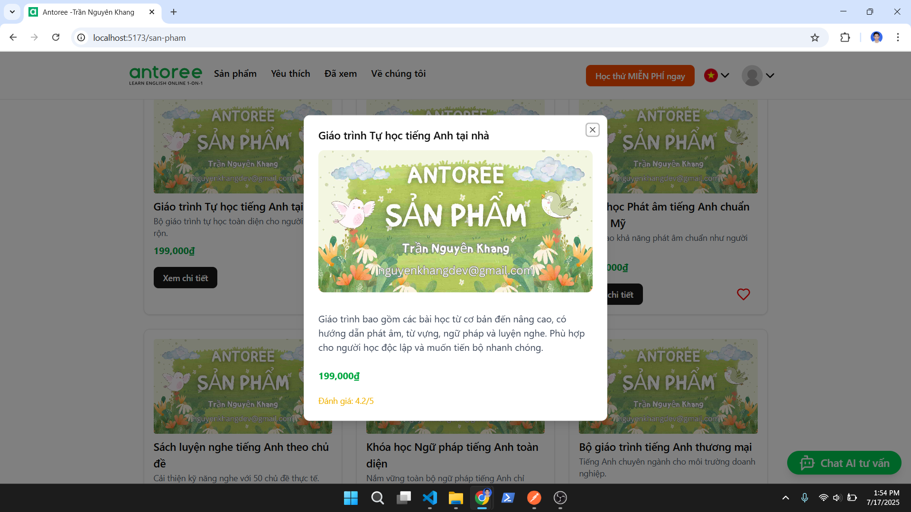

# Bài kiểm tra Front-end (FE) về sàn giáo dục thương mại điện tử sử dụng AI

- Ứng viên: Trần Nguyên Khang
- Email: nguyenkhangdev@gmail.com
- Công ty: Công ty TNHH Phát triển Giáo dục Antoree
- Thời gian: 10/07/2025 – 12:00 17/07/2025, em bắt đầu làm từ tối 14/07

Đây là dự án giao diện người dùng (Front-End) được xây dựng nhằm mục đích làm bài kiểm tra kỹ thuật cho vị trí lập trình viên Front-End. Dự án mô phỏng một sàn thương mại điện tử về giáo dục có tích hợp AI gợi ý thông minh.

- Link web demo: https://antoree.nguyenkhangdev.id.vn
- Video demo: https://youtu.be/FYSwxAyk_KQ
- Link đề bài: https://docs.google.com/document/d/1fimDJGCBDObRPwPmXtIzScON7bdoBwKE/edit?usp=sharing&ouid=114488607069757309086&rtpof=true&sd=true
- Postman: https://www.postman.com/lunar-rocket-501382/workspace/antoree-intern-frontend-trannguyenkhang/collection/29459136-48d86deb-571a-4b5c-96ed-3bbaf62a8176?action=share&creator=29459136&active-environment=29459136-e707d28d-5cf1-4b9f-96e9-cd57f97ca2cf

## Project Structure

```
.
├── public/                         # Tài nguyên tĩnh (ảnh, favicon...)
├── src/                            # Mã nguồn chính
│   ├── assets/                     # Hình ảnh, biểu tượng, tệp media
│   ├── components/                # Các component tái sử dụng được
│   ├── layouts/                   # Layout dùng chung cho các trang
│   │   └── MainLayout.jsx         # Layout chính chứa header/footer
│   ├── lib/                       # Thư viện phụ trợ, helper, hàm tiện ích
│   ├── pages/                     # Các trang tương ứng với route
│   ├── routes/                    # Cấu hình định tuyến
│   │   └── AppRoutes.jsx          # Các route chính của ứng dụng
│   ├── services/                  # API service, hàm gọi backend
│   ├── App.jsx                    # Component gốc
│   ├── main.jsx                   # Điểm khởi tạo React
│   └── index.css                  # CSS gốc
├── .env-example                   # Mẫu biến môi trường
├── .gitignore                     # Bỏ qua các tệp khi push Git
├── index.html                     # HTML chính dùng bởi Vite
├── package.json                   # Thông tin dự án và dependencies
├── package-lock.json              # Khóa phiên bản phụ thuộc
├── README.md                      # Tài liệu hướng dẫn sử dụng
├── vercel.json                    # Cấu hình deploy trên Vercel
└── vite.config.js                 # Cấu hình cho Vite
```

## Cách build và run

### Yêu cầu hệ thống

- Node.js >= 16
- npm (hoặc yarn/pnpm)

### Cài đặt

- 1. Clone về máy

```
git clone https://github.com/nguyenkhangdev/Antoree_Intern-FrontEnd_TranNguyenKhang.git
cd Antoree_Intern-FrontEnd_TranNguyenKhang
```

- 2. Build cho production

```
npm install
npm run build
npm run preview
```

- 3. truy cập `http://localhost:4173/` để xem sản phẩm

## Một số hình ảnh

### Menu cho mobile


Trang web hỗ trợ tốt cho responsive.

---

### Chatbox AI


Chức năng chat box AI: người dùng gửi yêu cầu, AI phản hồi lại mô tả yêu cầu và đưa danh sách các sản phẩm phù hợp, có thể liên kết đến trang chi tiết sản phẩm.

---

### Trang danh sách sản phẩm


Hỗ trợ tìm kiếm theo các thuộc tính, từ khóa và phân trang. Các thẻ sản phẩm có hỗ trợ tương tác hiệu ứng linh hoạt.

---

### Modal sản phẩm



Modal xem trước sản phẩm mượt mà.

---

### Trang Chi tiết sản phẩm


Hiển thị chi tiết các thông tin sản phẩm, có phần gợi ý sản phẩm bên dưới.

---

### Trang sản phẩm yêu thích


Danh sách các sản phẩm yêu thích, tương tác hiệu ứng linh hoạt.

---

### Trang sản phẩm đã xem


Lưu các sản phẩm vừa xem, hiệu ứng giống trang danh sách sản phẩm.

---

### Sản phẩm gợi ý


Các sản phẩm được gợi ý được trình chiếu cuộn ngang tự động đẹp mắt.

---

### Phần chân trang - Footer


Footer mô phỏng lại trang của quý công ty.

## Điều khoản và Bản quyền

Copyright (c) 2025 Trần Nguyên Khang

Dự án này được thực hiện và nộp cho mục đích đánh giá năng lực kỹ thuật trong quá trình tuyển dụng tại Công ty TNHH Phát triển Giáo dục Antoree.

Toàn bộ mã nguồn trong dự án này thuộc quyền sở hữu của tác giả Trần Nguyên Khang. Nghiêm cấm sao chép, tái sử dụng, phân phối hoặc đưa vào hệ thống sản phẩm thật dưới bất kỳ hình thức nào nếu không có sự đồng ý bằng văn bản từ tác giả.

Mọi hành vi sử dụng trái phép đều có thể bị phản ánh công khai hoặc xử lý theo quy định pháp luật.

Nếu quý công ty hoặc cá nhân có nhu cầu trao đổi, đánh giá hoặc sử dụng lại một phần mã nguồn, vui lòng liên hệ qua email nguyenkhangdev@gmail.com

## Lời cảm ơn

Cảm ơn anh/chị đã dành thời gian xem và đánh giá bài làm này. Rất mong có cơ hội trao đổi sâu hơn trong vòng tiếp theo.
